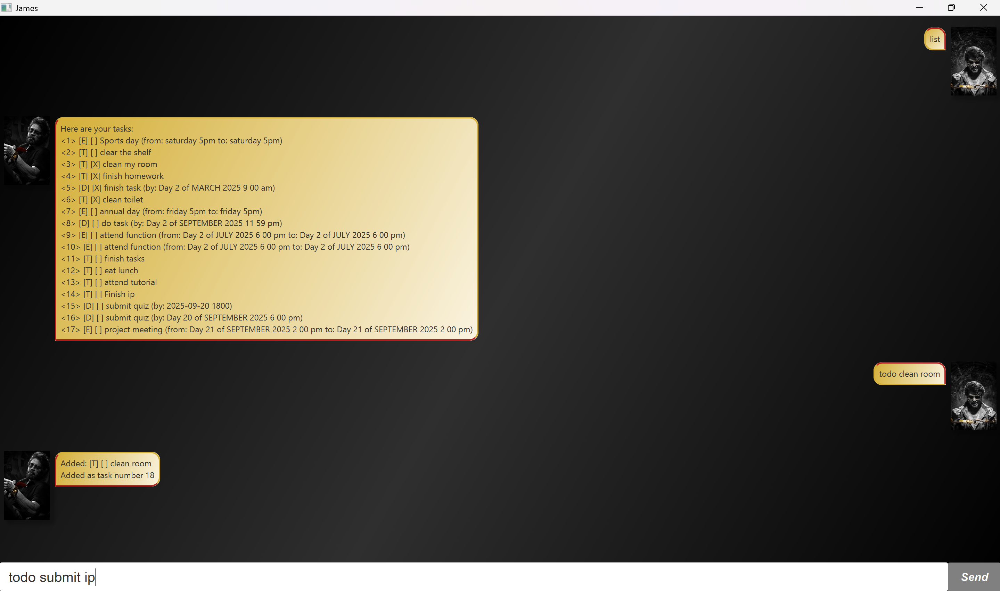

# James User Guide



James is a chatbot based on a movie theme that you can use to store,
retrieve, mark or unmark tasks. You may store tasks of the type "deadline", "todo"
or event

## Quick Reference

| Command   | Format | Example                                                       |
|-----------|--------|---------------------------------------------------------------|
| todo | `todo <description>` | `todo buy vegetables`                                         |
| deadline | `deadline <description> /by <date time>` | `deadline submit assignment /by 20/9/2025 1800`               |
| event | `event <description> /from <date time> /to <date time>` | `event club cohesion /from 21/9/2025 1400 /to 21/9/2025 1600` |
| list | `list` | `list`                                                        |
| mark | `mark <task number> [<task number> ...]` | `mark 1 3`                                                    |
| unmark | `unmark <task number> [<task number> ...]` | `unmark 2`                                                    |
| delete | `delete <task number> [<task number> ...]` | `delete 2 3`                                                  |
| bye | `bye` | `bye`                                                         |

---


## Adding Deadlines

The deadline command is used to add a task with a due date and time.

Example:
```
deadline submit assignment /by 20/9/2025 1800
```

Expected Output:
```
Added: [D][ ] submit assignment (by: Day 20 of SEPTEMBER 2025 6 00 pm)
Added as task number 1
```

---

## Adding Todos

The todo command adds a simple task without any date or time.

Example:
```
todo buy vegetables
```

Expected Output:
```
Added: [T][ ] buy vegetables
Added as task number 2
```

---

## Adding Events

The event command adds a task that spans a start and end time.

Example:
```
event club cohesion /from 21/9/2025 1400 /to 21/9/2025 1600
```

Expected Output:
```
Added: [E][ ] club cohesion (from: Day 21 of SEPTEMBER 2025 2 00 pm to: Day 21 of SEPTEMBER 2025 4 00 pm)
Added as task number 3
```

---

## Listing Tasks

The list command shows all the tasks currently stored.

Example:
```
list
```

Expected Output:
```
Here are your tasks:
<1> [D][ ] submit assignment (by: Day 20 of SEPTEMBER 2025 6 00 pm)
<2> [T][ ] buy vegetables
<3> [E][ ] club cohesion (from: Day 21 of SEPTEMBER 2025 2 00 pm to: Day 21 of SEPTEMBER 2025 4 00 pm)
```

---

## Marking and Unmarking Tasks

The mark command marks tasks as completed, and the unmark command resets them to incomplete.  
You can mark/unmark multiple tasks at once.

Example (single):
```
mark 2
```
Expected Output:
```
marked:
[D][X] submit assignemnt (by: Day 20 of SEPTEMBER 2025 6 00 pm)
```

Example (multiple):
```
mark 1 3
```
Expected Output:
```
marked:
[T][X] buy vegetables
[E][X] club cohesion (from: Day 21 of SEPTEMBER 2025 2 00 pm to: Day 21 of SEPTEMBER 2025 4 00 pm)
```

Unmark Example:
```
unmark 2
```

Expected Output:
```
unmarked:
[D][ ] submit assignemnt (by: Day 20 of SEPTEMBER 2025 6 00 pm)
```
Unmark Example (multiple):

```
unmark 1 3
```
Expected output: 

```
unmarked:
[T][X] buy vegetables
[E][X] club cohesion (from: Day 21 of SEPTEMBER 2025 2 00 pm to: Day 21 of SEPTEMBER 2025 4 00 pm)
```

---

## Deleting Tasks

The delete command removes tasks from the list.  
You can delete multiple tasks at once.

Example (single):
```
delete 1
```
Expected Output:
```
deleted:
[T][ ] buy vegetables
```

Example (multiple):
```
delete 2 3
```
Expected Output:
```
deleted:
[D][ ] submit assignmnet (by: Day 20 of SEPTEMBER 2025 6 00 pm)
[E][ ] club cohesion (from: Day 21 of SEPTEMBER 2025 2 00 pm to: Day 21 of SEPTEMBER 2025 4 00 pm)
```

---

## Exiting the Application

The bye command saves all tasks and exits the program.

Example:
```
bye
```

Expected Output:
```
Bye, feel free to ask me anything anytime!
```
You may alternately just close the application and all your tasks will be saved.
